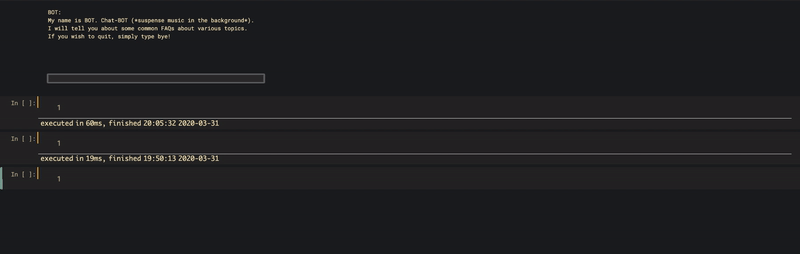

# Chatbot-NLTK
Here is a quick demo of a chatbot I prepared using Natural Language Tool Kit (NLTK) in Python.

The user can input any topic of his/her interest and the bot returns a very common FAQ related to the input.

The model has been trained on a modified Wikipedia QnA dataset.

